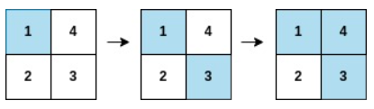
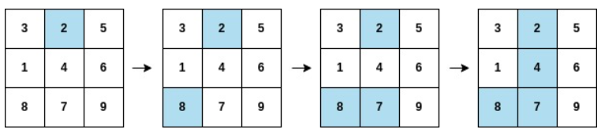

# 描述:
You are given a 0-indexed integer array arr, and an m x n integer matrix mat. arr and mat both contain all the integers in the range [1, m * n].
Go through each index i in arr starting from index 0 and paint the cell in mat containing the integer arr[i].
Return the smallest index i at which either a row or a column will be completely painted in mat.

Example 1:

  
Input: arr = [1,3,4,2], mat = [[1,4],[2,3]]
Output: 2
Explanation: The moves are shown in order, and both the first row and second column of the matrix become fully painted at arr[2].
Example 2:
  
Input: arr = [2,8,7,4,1,3,5,6,9], mat = [[3,2,5],[1,4,6],[8,7,9]]
Output: 3
Explanation: The second column becomes fully painted at arr[3].
 
Constraints:
m == mat.length
n = mat[i].length
arr.length == m * n
1 <= m, n <= 105
1 <= m * n <= 105
1 <= arr[i], mat[r][c] <= m * n
All the integers of arr are unique.
All the integers of mat are unique.

## 解題思路:  
此題需先理解題意，首先arr為一個一維陣列，元素不重覆，mat二維陣列的長度與arr相等，元素為arr的元素，長度為m*n，題目要求遍歷arr元素，對應到mat陣列並填充該元素的行列值，滿足條件為當某一行或某一列被填滿，返回該arr元素值，目的為找到此最小的arr元素，我們需要以下變數:  
1. unordered_map<int,pair<int,int>> mp:儲存mat[i][j]元素的i,j值  
2. cntRow(行數,0):紀錄某行是否被填滿  
3. cntCol(列數,0):紀錄某列是否被填滿  
4. 使用auto& v = mp[arr[i]]取出該元素的行列值(v.first、v.second)

版本一:
```C++
class Solution {
public:
    int firstCompleteIndex(vector<int>& arr, vector<vector<int>>& mat) {
        int n = mat.size();     // 取出mat有幾行
        int m = mat[0].size();  // 取出mat每一行有幾個元素(有幾列)
        unordered_map<int,pair<int,int>> mp; // mp儲存mat元素值及其對應的行列值
        for(int i = 0;i < n;i++){
            for(int j = 0;j < m;j++){
                mp[mat[i][j]] = {i,j};
            }
        }
        vector<int> cntRow(n,0);  // 紀錄一行是否被填滿
        vector<int> cntCol(m,0);  // 紀錄一列是否被填滿
        for(int i = 0;i < arr.size();i++){
            // v變數儲存arr[i]元素(對應到mat陣列裡的元素)的行列值
            auto& v = mp[arr[i]];
            cntRow[v.first]++;  // v.first代表其在第幾行
            if(cntRow[v.first] == m){ // 某一行已被填滿(已存在m個元素，某行飽和)
                return i;
            }
            cntCol[v.second]++; // v.second代表其在第幾列
            if(cntCol[v.second] == n){ // 某一列已被填滿(已存在n個元素，某列飽和)
                return i;
            }
        }
        return -1;
    }
};
```

時間複雜度: O(m*n+k)  
m、n為mat陣列行列大小，一開始先建造unorder_map用兩個for花O(m*n)，之後遍歷大小為k的arr花O(k)  
空間複雜度: O(m+n)，此題創造三個變數，unordered_map大小m+n，cntRow與cntCol分別大小為n、m，故空間為O(m+n+n+m)=O(m+n)

