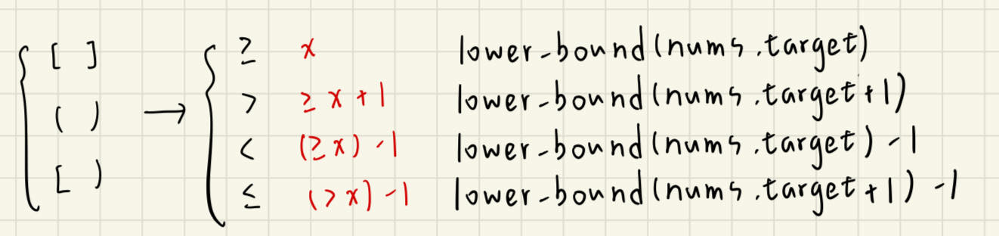

## 描述:
Given a 0-indexed integer array nums of size n and two integers lower and upper, return the number of fair pairs.

A pair (i, j) is fair if:

0 <= i < j < n, and
lower <= nums[i] + nums[j] <= upper  

Example 1:  
Input: nums = [0,1,7,4,4,5], lower = 3, upper = 6  
Output: 6  
Explanation: There are 6 fair pairs: (0,3), (0,4), (0,5), (1,3), (1,4), and (1,5).  

Example 2:  
Input: nums = [1,7,9,2,5], lower = 11, upper = 11  
Output: 1  
Explanation: There is a single fair pair: (2,3).
 

Constraints:  
1 <= nums.length <= 105  
nums.length == n  
-109 <= nums[i] <= 109  
-109 <= lower <= upper <= 109  

## 解題思路:
本題要找公平數對的數量，其中公平數對的條件是 lower <= nums[i] + nums[j] <= upper 且 i < j 。  

假設有一數對符合條件，且位置為 (0,5)，則就算排序後位址打亂，但兩者相加還是位於區間內，仍可以成為公平數對，所以位址不影響答案，故可以先排序，目的是為了使用 Binary Search。  

其本質就是找兩個數，看是否在區間內   
=> 枚舉 nums[j]，看 nums[i] 可以是哪些數，題目是要尋找公平數對的「**數量**」，故只要看 nums[i] 有幾個即可。  

**lower <= nums[i] + nums[j] <= upper**  
nums[i] 範圍: **lower - nums[j] <= nums[i]  <= upper - nums[j]**，求此區間內元素個數  

注意由於陣列已經排序過，所以可以看索引來得知該元素之前有幾個元素，相當於有幾個元素 < 目前元素。

如何求:  
  <= upper - nums[j] 的元素個數:  >  upper - nums[j] 的第一個元素下標位址  
減 < lower - nums[j] 的元素個數:  >= lower - nums[j] 的第一個元素下標位址  

上述即可用二分查找的簡單函式去求 >= target 的第一個元素位址，並依照尋找目標不同，如>、<=、<，用 lower_bound 閉區間的寫法來完成，以不同 target 模式來替換。  
  

有一點要注意，此方法相當於先定一個數 target，並針對此數去檢查陣列中是否有符合條件的數，但由於規定 i < j，若我們進行二分查找時不規定界限而遍歷整個陣列，則會重複計算公平數對，如 (i,j)、(j,i) 被視為兩個，因此我們先枚舉 j 去尋找 i，會假定 j 是索引位址較大的數，因此 i 的範圍只能在 0 ~ j-1 區間尋找，索引在 lower_bound() 函式的參數輸入要改變。

```C++
class Solution {
public:
    // 返回陣列中第一個 >= target 的數的位址
    int lower_bound(int l,int r,vector<int>& nums,int target){
        while(l <= r){
            int mid = l + (r - l)/2;
            if(nums[mid] < target){
                l = mid + 1;
            }
            else{
                r = mid - 1;
            }

        }
        return l;
    }
    long long countFairPairs(vector<int>& nums, int lower, int upper) {
        sort(nums.begin(),nums.end());
        long long ans = 0;  // 公平數對的數量

        // 枚舉 nums[j]，計算另一數 nums[i] 的範圍內元素個數
        for(int j = 0;j < nums.size();j++){     
            // 計算 < lower - nums[j] 的元素個數 (相當於 >= lower - nums[j] 的第一個元素下標位址)
            int i_lower = lower_bound(0,j - 1, nums,lower - nums[j]);
            // 計算 <= upper - nums[j] 的元素個數 (相當於 > upper - nums[j] 的第一個元素下標位址)
            int i_upper = lower_bound(0,j - 1, nums,upper - nums[j] + 1);
            ans += i_upper - i_lower;  // 代表此合法區間內的 nums[i]
        }
        return ans;
    }
};
```
時間複雜度: O(nlogn)，枚舉陣列所有元素，且都做一次 Binary Search，花 O(n) * O(logn)  
空間複雜度: O(1)