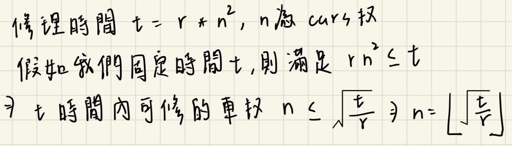
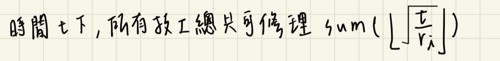

## 描述:
You are given an integer array ranks representing the ranks of some mechanics. ranksi is the rank of the ith mechanic. A mechanic with a rank r can repair n cars in r * n2 minutes.

You are also given an integer cars representing the total number of cars waiting in the garage to be repaired.

Return the minimum time taken to repair all the cars.

Note: All the mechanics can repair the cars simultaneously.  

Example 1:  
Input: ranks = [4,2,3,1], cars = 10  
Output: 16  

Explanation:   
- The first mechanic will repair two cars. The time required is 4 * 2 * 2 = 16 minutes.  
- The second mechanic will repair two cars. The time required is 2 * 2 * 2 = 8 minutes.  
- The third mechanic will repair two cars. The time required is 3 * 2 * 2 = 12 minutes.  
- The fourth mechanic will repair four cars. The time required is 1 * 4 * 4 = 16 minutes.  
It can be proved that the cars cannot be repaired in less than 16 minutes.​​​​​  

Example 2:  
Input: ranks = [5,1,8], cars = 6  
Output: 16  

Explanation:   
- The first mechanic will repair one car. The time required is 5 * 1 * 1 = 5 minutes.  
- The second mechanic will repair four cars. The time required is 1 * 4 * 4 = 16 minutes.  
- The third mechanic will repair one car. The time required is 8 * 1 * 1 = 8 minutes.  
It can be proved that the cars cannot be repaired in less than 16 minutes.​​​​​  

Constraints:  
1 <= ranks.length <= 105  
1 <= ranks[i] <= 100  
1 <= cars <= 106

## 解題思路:
此題很多人光看 explanation 會陷入一個謬誤，需要思考如何分配修理汽車的個數給每位技工，以達到最短時間，這樣根本不知從何下手。  

要注意一個提示: All the mechanics can repair the cars simultaneously，因此若給予相同時間 t，所有技工是可以同時進行修車的，由此就很簡單得出我們應該是要去計算 t，找出可以修完所有汽車的最短時間 t。  

  

由上述結果可知當時間 t 越長，每位技工能修的車數量越多，越能符合要求，這樣的**單調性**剛好適合用二分搜尋法解決。  

而我們就是要對儲存由小到大的時間 t 陣列做二分查找，計算每位技工用 mid 時間修裡的車輛數量並加總，當 sum 滿足題目條件 n，代表此時間示足夠修理所有汽車的，則可以往左所小範圍繼續用二分，否則往右加大時間。    

  

