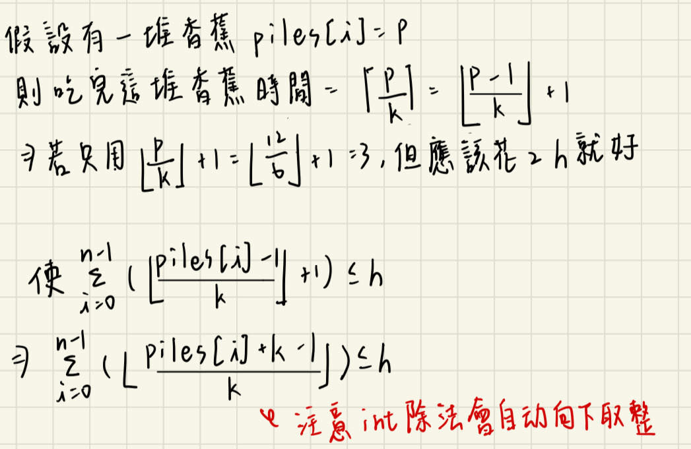

## 描述:
Koko loves to eat bananas. There are n piles of bananas, the ith pile has piles[i] bananas. The guards have gone and will come back in h hours.  

Koko can decide her bananas-per-hour eating speed of k. Each hour, she chooses some pile of bananas and eats k bananas from that pile. If the pile has less than k bananas, she eats all of them instead and will not eat any more bananas during this hour.  

Koko likes to eat slowly but still wants to finish eating all the bananas before the guards return.  

Return the minimum integer k such that she can eat all the bananas within h hours.  

Example 1:  
Input: piles = [3,6,7,11], h = 8  
Output: 4  

Example 2:  
Input: piles = [30,11,23,4,20], h = 5  
Output: 30  

Example 3:  
Input: piles = [30,11,23,4,20], h = 6  
Output: 23 

Constraints:  
1 <= piles.length <= 10^4  
piles.length <= h <= 10^9  
1 <= piles[i] <= 109

## 解題思路:
此題我們先了解題目特性，看 example 1: piles = [3,6,7,11], h = 8  
若 Koko 可以用 k = 4 的速度在時間內吃完香蕉，則其一定可以在 k =5,6...的速度內吃完  
若 Koko 不能用 k = 3 的速度吃完香蕉，則必不能在 k = 2,1.. 速度內吃完  
這種**單調性**適合用二分查找解題  

而此題要求最短的速度 k，因此直接二分速度就好，二分的左邊界為 1，右邊界該如何得知呢，注意題目有限制 piles.length <= h，因此只要速度為 piles 陣列最大值必可以在 h 時間內吃完全部香蕉(每群香蕉都只花 1 時間吃完)，因此右邊界為 max(piles)。  

現在要判斷的是，在 k 的速度是否能在 h 時間內吃所有香蕉:    
  

```C++
class Solution {
public:
    int minEatingSpeed(vector<int>& piles, int h) {
        sort(piles.begin(),piles.end());
        int n = piles.size();
        int l = 1;
        int r = piles[n - 1];
        while(l <= r){
            int k = l + (r - l)/2;
            long long sum = 0;
            for(int p : piles){
                sum += (p + k - 1) / k;
            }
            if(sum <= h){
                r = k - 1;
            }
            else{
                l = k + 1;
            }
        }
        return l;
    }
};
```
時間複雜度: O(nlogm)，n 為 piles 長度，而 m 為 max(piles)，每次二分都花 O(logm) 時間  
空間複雜度: O(1)
