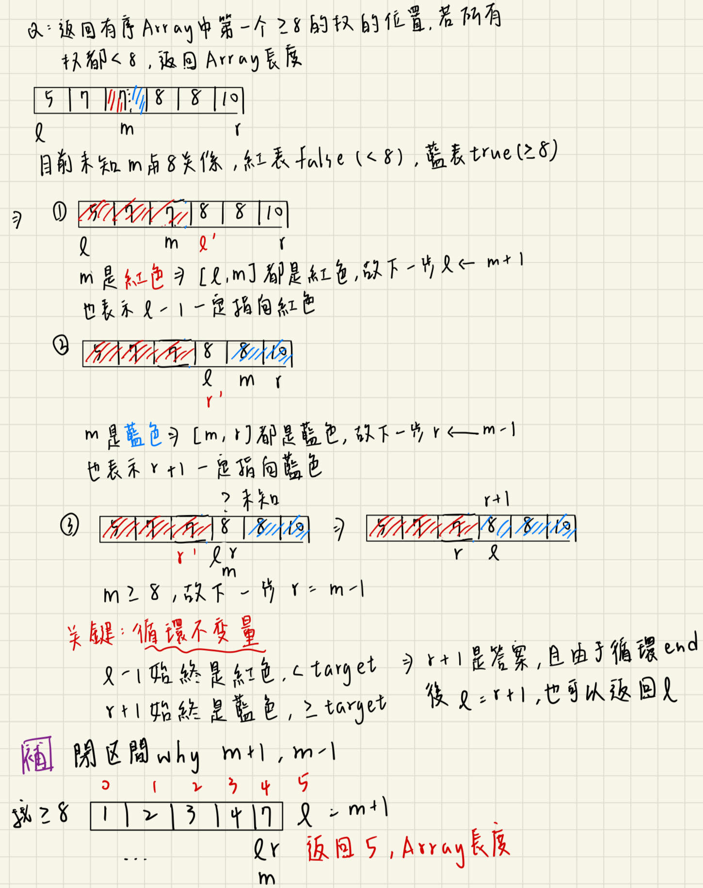
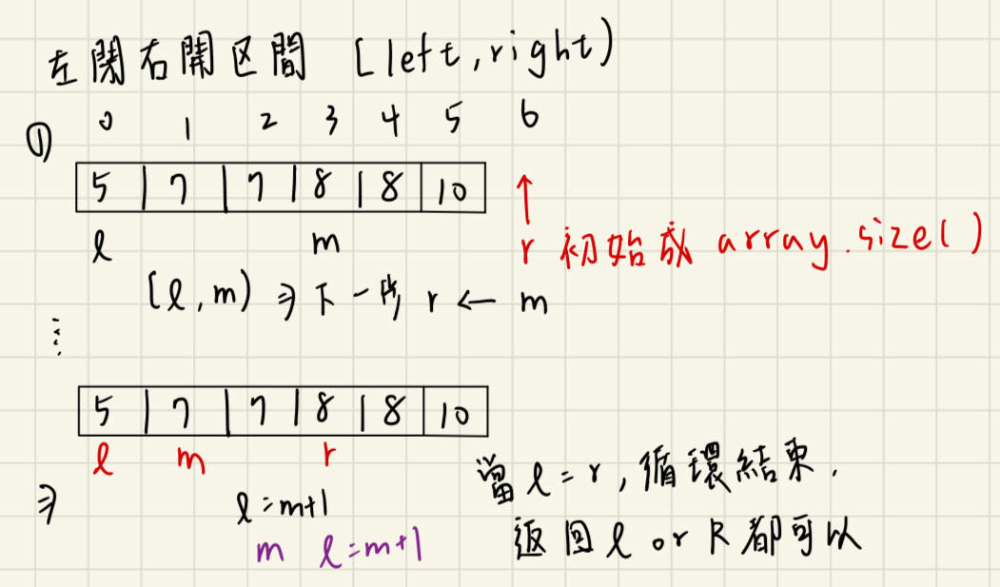
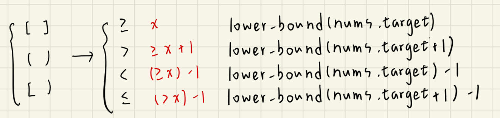

# Binary Search的概念與寫法
分為閉區間、開區間、半開半閉區間，首先要確保Array內元素是有序的

## 1.閉區間


```C++
int lower_bound(vector<int>& nums,int target){
    int left = 0;
    int right = nums.size() - 1;  // 閉區間[left,right]
    while(left <= right){
        int mid = left + (right-left)/2;
        if(nums[mid] < target>) 
            left = mid + 1;
        else if(nums[mid] >= target) 
            right = mid -1;
    }
    return left;
}
```

## 2.左閉右開區間 [left,right)

```C++
int lower_bound2(vector<int>& nums,int target){
    int left = 0;
    int right = nums.size();  // 閉區間[left,right]，right初始為array長度
    while(left < right){      // 若l==r循環結束
        int mid = left + (right-left)/2;
        if(nums[mid] < target>) 
            left = mid + 1;
        else if(nums[mid] >= target) 
            right = mid;
    }
    return left;
}
```

## 3.開區間 (left,right)
```C++
int lower_bound3(vector<int>& nums,int target){
    int left = -1;
    int right = nums.size();  // 開區間(left,right]，left初始為-1，right初始為array長度
    while(left + 1 < right){  // 若l+1==r循環結束
        int mid = left + (right-left)/2;
        if(nums[mid] < target>) 
            left = mid;
        else if(nums[mid] >= target) 
            right = mid;
    }
    return right;  // or return left+1
}
```

三種區間的while判斷式分別為:  
* 閉區間:當下一次循環為right < left，則返回left
* 左閉右開區間:當下一次循環為right == left，則返回left
* 開區間:當下一次循環為left + 1 == right，則返回right  

而上述例題是想要找>=target的數裡的起始位置，若今天尋找目標不同，如>、<=、<，也可以用lower_bound閉區間的寫法來完成，以不同target模式來替換，如下圖


