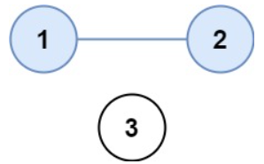

# 描述:
There are n cities. Some of them are connected, while some are not. If city a is connected directly with city b, and city b is connected directly with city c, then city a is connected indirectly with city c.

A province is a group of directly or indirectly connected cities and no other cities outside of the group.

You are given an n x n matrix isConnected where isConnected[i][j] = 1 if the ith city and the jth city are directly connected, and isConnected[i][j] = 0 otherwise.

Return the total number of provinces.

Example 1:  
  

Input: isConnected = [[1,1,0],[1,1,0],[0,0,1]]  
Output: 2

Example 2:  
Input: isConnected = [[1,0,0],[0,1,0],[0,0,1]]  
Output: 3  

Constraints:    
1 <= n <= 200  
n == isConnected.length  
n == isConnected[i].length  
isConnected[i][j] is 1 or 0.  
isConnected[i][i] == 1  
isConnected[i][j] == isConnected[j][i]

## 解題思路:
此題考的是圖型的 DFS 與 BFS，首先圖型是以 Adjency matrix 儲存，且 matrix[i][i] = 1，與平常的相鄰矩陣不太一樣，不過這不影響解題，題目中的「Provinces」是指所有間接或直接相鄰的頂點所組成的群組，一個圖中可能有多個 provinces，我們想找出圖中有幾個 provinces，而 DFS、BFS 搜尋都是不斷以相鄰頂點延伸，直到無法在走到任何未被拜訪的頂點，因此一次的 DFS、BFS 可以走遍一個 province，我們只需要針對每個尚未拜訪的頂點 i 做搜尋即可，觀察在程式中共做了幾次搜尋。  


* DFS 解法
```C++
class Solution {
public:
    void DFSUtil(vector<vector<int>>& isConnected, vector<int> &visited, int v){
        int n = isConnected.size();
        for(int i = 0;i < n;i++){
            // 若點 i 與 v 相鄰且 i 尚未被拜訪，則繼續對其做 DFS
            if(isConnected[v][i] == 1 && visited[i] != 1){
                visited[i] = 1;  // i 設為被拜訪
                DFSUtil(isConnected,visited,i);
            }
        }
    }
    // 用 DFS 解
    int findCircleNum(vector<vector<int>>& isConnected) {
        int n = isConnected.size();
        int provinces = 0;  
        // visited 儲存頂點拜訪與否，0 表示尚未拜訪
        vector<int> visited(n,0);
        // 針對每個頂點判斷若其尚未拜訪則對該點做 DFS
        for(int i = 0;i < n;i++){
            if(visited[i] != 1){
                DFSUtil(isConnected,visited,i); // DFS 只會追蹤所有與頂點直接或間接相鄰的點
                provinces++;  
            }
        }
        return provinces;
    }
};
```
時間複雜度: O(n2)，n 為頂點數，最壞情況是每個頂點都各自為一個 province，主程式會做 n 次 DFS,而每次 DFS 都花 O(n) time。  
空間複雜度: O(n)，visited 陣列大小即為頂點數。  

* BFS 解法
```C++
class Solution {
public:
    void BFS(vector<vector<int>>& isConnected,vector<int> &visited,int v){
        int n = isConnected.size();     
        queue<int> q;
        q.push(v);
        // 持續拜訪直到 queue 為空
        while(!q.empty()){
            int i = q.front();
            q.pop();
            // 對於相鄰於點 i 且上未被拜訪的點 j
            for(int j = 0;j < n;j++){
                if(isConnected[i][j] == 1 && visited[j] != 1){
                    visited[j] = 1;  // 拜訪 j
                    q.push(j);       // 將 j 加入 queue 中
                }
            }
        }
    }
    // 用 BFS 解
    int findCircleNum(vector<vector<int>>& isConnected) {
        int n = isConnected.size();
        int provinces = 0;
        vector<int> visited(n,0);
        for(int i = 0;i < n;i++){
            if(visited[i] != 1){
                BFS(isConnected,visited,i);
                provinces++;
            }
        }
        return provinces;
    }
};
```
時間複雜度: O(n2)  
空間複雜度: O(2n) = O(n)，所用空間有 queue 與 visited

