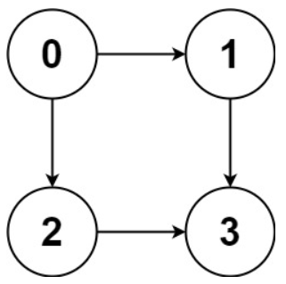
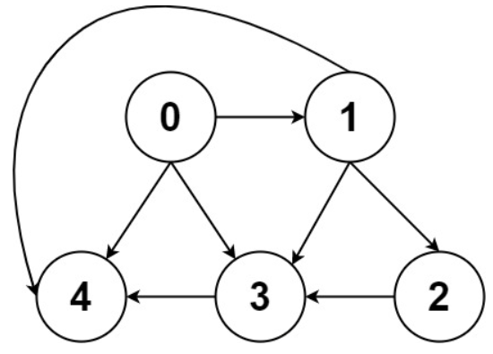
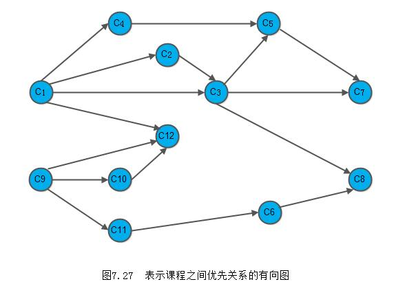
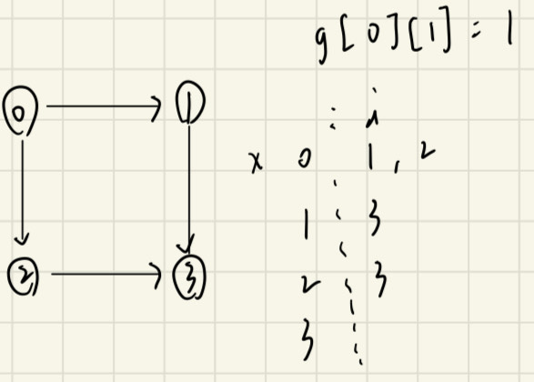

## 描述:
Given a directed acyclic graph (DAG) of n nodes labeled from 0 to n - 1, find all possible paths from node 0 to node n - 1 and return them in any order.

The graph is given as follows: graph[i] is a list of all nodes you can visit from node i (i.e., there is a directed edge from node i to node graph[i][j]).

Example 1:  
  
Input: graph = [[1,2],[3],[3],[]]  
Output: [[0,1,3],[0,2,3]]  
Explanation: There are two paths: 0 -> 1 -> 3 and 0 -> 2 -> 3.  

Example 2:  

Input: graph = [[4,3,1],[3,2,4],[3],[4],[]]  
Output: [[0,4],[0,3,4],[0,1,3,4],[0,1,2,3,4],[0,1,4]]  

Constraints:  
n == graph.length  
2 <= n <= 15  
0 <= graph[i][j] < n  
graph[i][j] != i (i.e., there will be no self-loops).  
All the elements of graph[i] are unique.  
The input graph is guaranteed to be a DAG


## 解題思路:
此題給予 <font color = 'red'>DAG 有向無環圖</font>，要尋找從起始節點 0 到終點 n-1 的所有路徑，我們要思考在圖型中該用甚麼結構來解題。  

如下圖，假如我們想從 c1 走到 c7，可以有兩條路徑 c1->c3->c5->c7 和 c1->c3->c7，當走到 c3 時，我們有兩個點可以選擇前往，因此在尋找路徑時先選擇其中一個點前進，當此路徑尋找完畢，需要再<font color = 'red'>回溯</font>到 c3 的位置並選擇另一個點前往，這不就是 DFS 的概念嗎。

  

從起始點 0 開始遍歷每條路徑，也就是做 dfs 搜尋，並需要注意回溯條件(路徑到結尾，需換其他條走):  

```C++
void dfs(Graph,起始點){
    if(終止條件){
        存放結果
        return;
    }
    for(選擇: 與目前遍歷頂點有連結的點){
        處理該點;
        dfs(Graph,選擇的點);  // 從選擇的點開始再繼續尋找路徑
        回溯;  // 撤銷選擇的點
    }
}
```  

此題就結合了<font color = 'red'>回溯</font>與<font color = 'red'>遞迴</font>，所以此題分解步驟如下:

1. 確認遞迴函數、參數
```C++
vector<vector<int>> result; // 符合條件的路徑
vector<int> path;           // 0 節點到終點的路徑
// x：目前遍歷的點
void dfs (vector<vector<int>>& graph, int x) 
```   
2. 確認終止條件
```C++
// x 遍歷到結尾點時代表一條路徑已搜尋完畢
if(x == graph.size()-1){
    result.push_back(path);
    return;
}

3. 處理目前節點出發後的路徑  
    

首先確認 x 點連結了哪些點，graph[x] 儲存的即是其有相連的點
```C++
for(int i = 0;i < graph[x];i++)  
```
接著將選擇的點加到路徑中，並對選擇的點繼續搜尋路徑(做 dfs)
```C++
path.push_back(graph[x][i]);
dfs(graph,graph[x][i]); 
```  

因為在目前節點上，都可能有好幾個選擇可以前往，因此做完一次 dfs 後(找到一條路徑)，需要回溯到剛才分岔路的地方，將選擇的節點撤銷，換選擇另一個相連的點
```C++
path.pop()
```  

本題程式:
```C++
class Solution {
private:
    vector<int> path;  // 儲存單一路徑
    vector<vector<int>> result;
    void dfs(vector<vector<int>>& graph,int x){
        // 終止條件: x 已遍歷到結尾
        if(x == graph.size()-1){
            result.push_back(path);  // 將路徑加到 result
        }
        else{
            // 針對 x 點的所有射出點
            for(int i = 0;i < graph[x].size();i++){
                path.push_back(graph[x][i]);  // 將 graph[x][i] 點加進路徑
                dfs(graph,graph[x][i]);       // 從 graph[x][i] 開始再遞迴做 dfs，不斷加點進去
                path.pop_back();  // 撤銷該點
            }
        }  
    }
public:     
    vector<vector<int>> allPathsSourceTarget(vector<vector<int>>& graph) {
        path.push_back(0);  // 路徑永遠是從 0 開始
        dfs(graph,0);
        return result;
    }
};
```  
時間複雜度: O()

