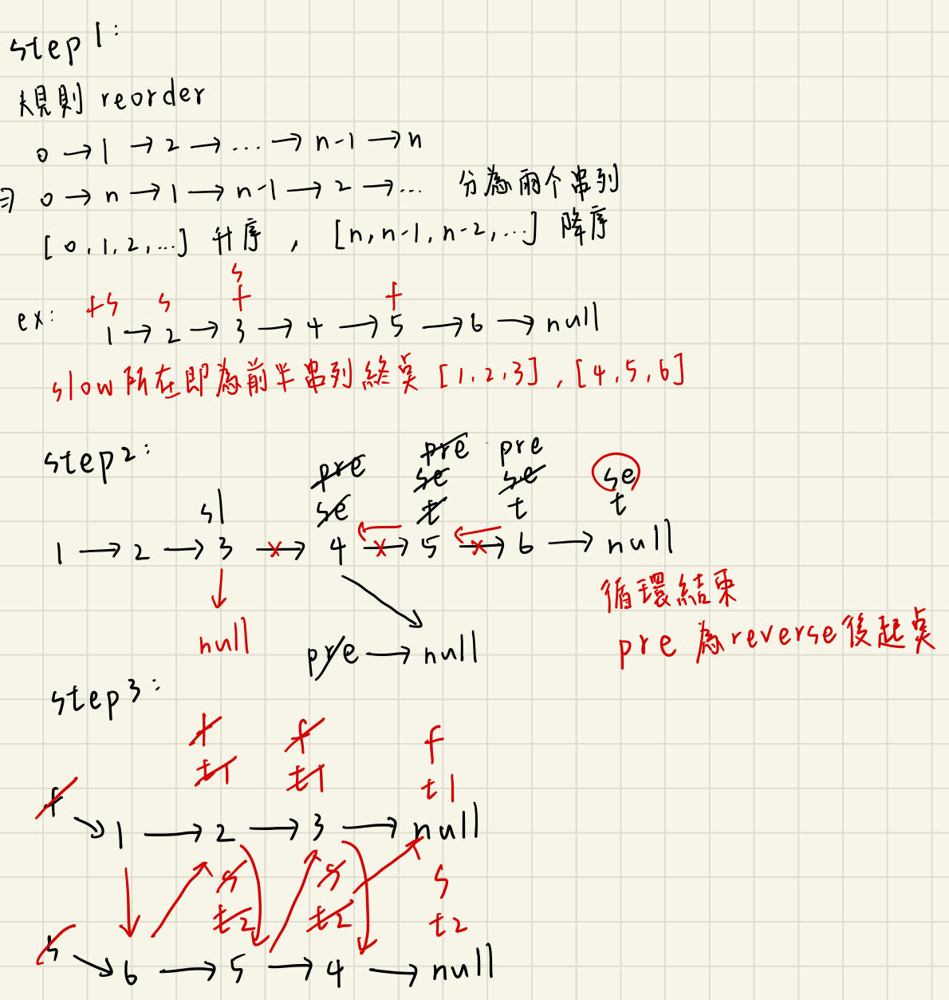

# 描述:
You are given the head of a singly linked-list. The list can be represented as:
L0 → L1 → … → Ln - 1 → Ln
Reorder the list to be on the following form:

L0 → Ln → L1 → Ln - 1 → L2 → Ln - 2 → …
You may not modify the values in the list's nodes. Only nodes themselves may be changed.

Example 1:
Input: head = [1,2,3,4]
Output: [1,4,2,3]

Example 2:
Input: head = [1,2,3,4,5]
Output: [1,5,2,4,3]

## 解題思路
此題須先理解題目規則，其Reorder順序為L0 → Ln → L1 → Ln - 1 → L2 → Ln - 2 → …，仔細觀察可以得出Reorder後串列有兩部分 => [L0、L1、L2...]、[Ln、Ln-1、Ln-2...]，第一個串列為原始串列的前半部且為升序，後半部串列為降序，經此兩串列Merge後即可得Reorder後的串列，而題目給予的void函式接收ListNode* head參數，即要直接修改原始串列。  

可以用三步驟來解此題:  
1. 先找出能分開前後兩串列的中點，此中點為前半部串列的終點，運用slow、fast指標可以快速找出此midpoint，其中slow pointer一次移動一步、fast pointer一次移動兩步。 
2. 將後半串列做Reverse，注意此處要運用到上一步找到的中點，建立一些指標進行Reverse操作。  
3. 將前後兩串列進行Merge，其中會運用到類似SWAP的概念，不斷將指標指派給額外創造的指標進行操作。

```C++

class Solution {
public:
    void reorderList(ListNode* head) {
        ListNode* slow = head;
        ListNode* fast = head;
        // step1.將linkedlist分為一半
        while(fast->next != nullptr && fast->next->next != nullptr){
            fast = fast->next->next;
            slow = slow->next;
        }
        // slow目前所指即為前半的串列終點
        // step2.將後半串列做reverse
        ListNode* second = slow->next; // second為後半串列的起點
        slow->next = nullptr;          // 先將前半串列的終點slow指向null
        ListNode *pre = nullptr;
        while(second){
            ListNode* temp = second->next;
            second->next = pre;
            pre = second;
            second = temp;
        }
        // pre即為後半串列reverse的起點

        ListNode* first = head;  // first為前半串列起點
        second = pre;  // second為後半串列起點

        // step3.合併前後兩串列
        while(second){;
            ListNode* t1 = first->next;
            ListNode* t2 = second->next;
            first->next = second;
            second->next = t1;
            first = t1;
            second = t2;
        }
    }
};
```
時間複雜度: O(n)，n為串列長度  
空間複雜度: O(1)
