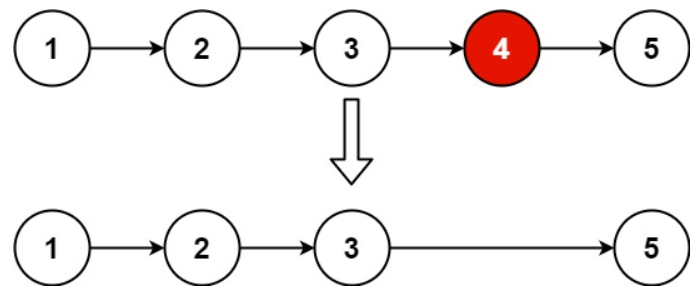
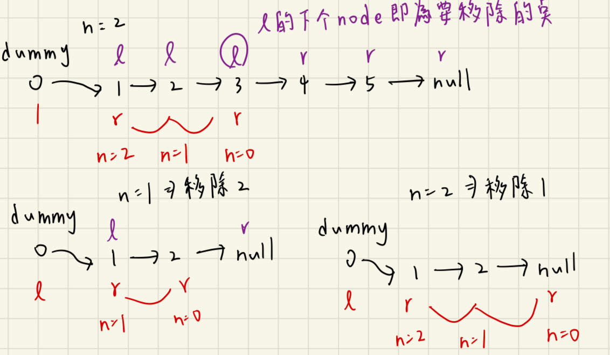

# 描述:
Given the head of a linked list, remove the nth node from the end of the list and return its head.

Example 1:

Input: head = [1,2,3,4,5], n = 2
Output: [1,2,3,5]

Example 2:
Input: head = [1], n = 1
Output: []

Example 3:
Input: head = [1,2], n = 1
Output: [1]
 
Constraints:
The number of nodes in the list is sz.
1 <= sz <= 30
0 <= Node.val <= 100
1 <= n <= sz

## 解題思路:
此題要移除的節點取決於n的值，移除從最尾端數來第n的節點，用一般的pointer移動方法只能從頭遍歷，很難找出從最尾端的第n個元素，可以使用兩pointer來找出要移除的節點位址，首先假設串列長度為m，n=2，則要移除的節點是倒數第二個，也等價於從頭遍歷m-n=m-2個節點，所以我們創造兩個節點**left**、**right**，先將right移動n步後，並將left固定，此時將right、left同步移動，right只要再移動m-n步則會到null，而left在此條件下也會移動m-n步，停止後即為移除的節點位址。
* 但要注意若left pointer剛好在要移除的節點位址，會無法執行delete，故應該要移至前一個node，這裡用一個很巧妙的技巧 => <font color = 'red'>dummy node</font>，將此假節點指向head，如此就可以倒退一個節點達到以上目的。  

版本一
```C++

class Solution {
public:
    ListNode* removeNthFromEnd(ListNode* head, int n) {
        ListNode dummy(0,head);  // 此dummy node的next指向head;
        ListNode* left = &dummy;  // left為dummy 位址
        ListNode* right = head;   // right設為head位址
        // 先將right移動n步
        while(n > 0){
            right = right->next;
            n--;
        }
        // 再將right、left同步移動值到right為null
        while(right != nullptr){
            right = right->next;
            left = left->next;
        }
        // 此時left位址即為要移除的node的前一個node
        ListNode* deleteNode = left->next;
        left->next = left->next->next;
        delete deleteNode;
        return dummy.next;
    }
};
```
時間複雜度: O(k)，k為串列長度  
空間複雜度: O(1)，只使用dummy node