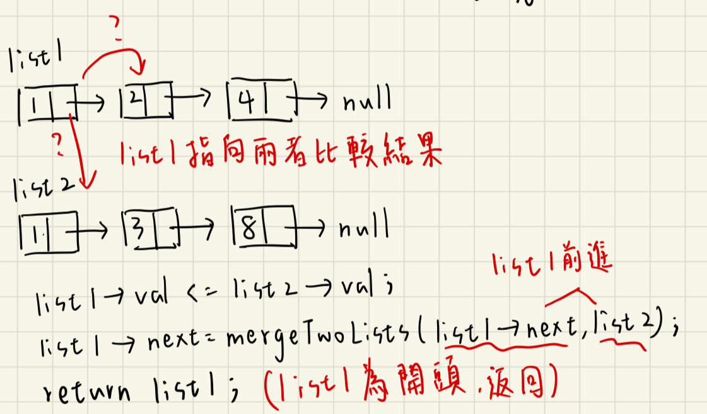
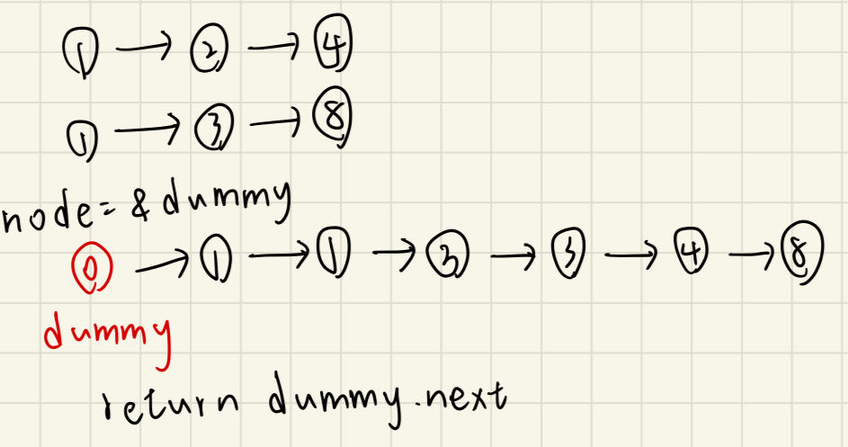

# 描述:
You are given the heads of two sorted linked lists list1 and list2.
Merge the two lists into one sorted list. The list should be made by splicing together the nodes of the first two lists.
Return the head of the merged linked list.

Example 1:
Input: list1 = [1,2,4], list2 = [1,3,4]
Output: [1,1,2,3,4,4]

Example 2:
Input: list1 = [], list2 = []
Output: []

Example 3:
Input: list1 = [], list2 = [0]
Output: [0]
 
Constraints:
The number of nodes in both lists is in the range [0, 50].
-100 <= Node.val <= 100
Both list1 and list2 are sorted in non-decreasing order.

## 解題思路:
此題可用兩種方法解，一是Recursion(遞迴)，二是一般的ListNode  

版本一:**Recursion**  
  
```C++
class Solution {
public:
    ListNode* mergeTwoLists(ListNode* list1, ListNode* list2) {
        // 若list1為空，則返回list2這裡可行是因為若list2也為空也會返回null，符合題意
        if(list1 == nullptr){
            return list2;
        }
        if(list2 == nullptr){
            return list1;
        }
        if(list1->val <= list2->val){
            // 若list1值較小，則list1會先取出並且next指向下一步[list1->next,list2]比較後的結果
            list1->next =  mergeTwoLists(list1->next,list2);
            // 若list1的值較小，會返回list1接在後面
            return list1;
        }
        else{
            list2->next = mergeTwoLists(list1,list2->next);
            // 若list2的值較小，會返回list2接在後面
            return list2;
        }
    }
};
```
時間複雜度: bset O(min(n,m))，worst O(n+m)  
best case為較短串列值皆較小，比較min(n,m)次即結束，min(n,m)為較短串列的長度，而worst case是兩個串列皆比到最後才結束，因此時間是O(n+m)  
空間複雜度: O(n+m)，遞迴所需使用到的stack


版本二:**Iterative**  
此法使用假結點dummy的概念，用一個node指標指向dummy位址，因此node可以直接操作dummy物件，但自始自終都是node指標在移動，dummy指標始終指向最一開始，所以最後返回的是dummy.next  

  
```C++
class Solution {
public:
    // 此法使用一個額外的節點來串接list1、list2合併後的串列
    ListNode* mergeTwoLists(ListNode* list1, ListNode* list2) {
        ListNode dummy(0);  // 先創造一個假節點dummy，其值為0
        ListNode* node = &dummy;  // 創造一個ListNode指標node指向dummy的位址
        // 當兩個串列都不為空
        while(list1 && list2){
            if(list1->val <= list2->val){
                node->next = list1;   // 將node指向list1(因list1值較小)
                list1 = list1->next;  // list1改為下個節點
            }
            else{
                node->next = list2;
                list2 = list2->next;
            }
            node = node->next;  // 比較完一次後node也要改為下個節點
            // 若list1已經沒有節點了
            if(list1 == nullptr){  
                node->next = list2;
            }
            else if(list2 == nullptr){
                node->next = list1;
            }
        }
        return dummy.next;  // 因為dummy的位址不變動始終指向最初答案鏈結開始的地方，所以返回dummy.next
    }
};
```
時間複雜度: O(n+m)  
空間複雜度: O(1)，因為只有使用到dummy及node指標