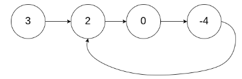

# 描述:
Given head, the head of a linked list, determine if the linked list has a cycle in it.
There is a cycle in a linked list if there is some node in the list that can be reached again by continuously following the next pointer. Internally, pos is used to denote the index of the node that tail's next pointer is connected to. Note that pos is not passed as a parameter.
Return true if there is a cycle in the linked list. Otherwise, return false.

 
Example 1:
Input: head = [3,2,0,-4], pos = 1
Output: true
  
Explanation: There is a cycle in the linked list, where the tail connects to the 1st node (0-indexed).

Example 2:
Input: head = [1,2], pos = 0
Output: true
Explanation: There is a cycle in the linked list, where the tail connects to the 0th node.
Example 3:

Input: head = [1], pos = -1
Output: false
Explanation: There is no cycle in the linked list.

版本一:
```C++
class Solution {
public:
    bool hasCycle(ListNode* head) {
        ListNode* fast = head;
        ListNode* slow = head;
        while(fast != nullptr){
            if(fast->next == nullptr){
                return false;
            }
            fast = fast->next->next;
            // 若fast、slow相遇到代表linked list有cycle
            if(fast == slow){
                return true;  
            }
            slow = slow->next;    
        }
        return false;
    }
};
```
時間複雜度: O(n)  
空間複雜度: O(1)，只運用到slow、fast兩個pointer