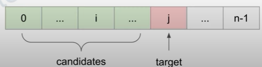

## 描述:
The frequency of an element is the number of times it occurs in an array.

You are given an integer array nums and an integer k. In one operation, you can choose an index of nums and increment the element at that index by 1.

Return the maximum possible frequency of an element after performing at most k operations.  

Example 1:  
Input: nums = [1,2,4], k = 5  
Output: 3  
Explanation: Increment the first element three times and the second element two times to make nums = [4,4,4].  
4 has a frequency of 3.  

Example 2:  
Input: nums = [1,4,8,13], k = 5  
Output: 2  
Explanation: There are multiple optimal solutions:  
- Increment the first element three times to make nums = [4,4,8,13]. 4 has a frequency of 2.  
- Increment the second element four times to make nums = [1,8,8,13]. 8 has a frequency of 2.  
- Increment the third element five times to make nums = [1,4,13,13]. 13 has a frequency of 2.  

Example 3:  
Input: nums = [3,9,6], k = 2  
Output: 1  

Constraints:  
1 <= nums.length <= 105  
1 <= nums[i] <= 105  
1 <= k <= 105

## 解題思路:
此題限定對陣列元素進行最多 k 次操作後，返回最高頻的元素次數。  

首先徹底觀察題目，操作只能是<font color = 'red'>增值(increment)</font>而不能減值，當一個雜亂的陣列出現時，我們想找到一個特定的 target 值，使範圍內的元素都增加不等的次數後值與 target 相同，但若是雜亂的陣列我們會不斷在 target 左右跳動操作，不僅沒效率還難以達成，故要先將陣列做排序。  

假如我們選定 target = nums[j]，則我們只能對 nums[i] 增值，其中 nums[i] < nums[j]。    

  

上述排序完畢後若使用暴力法，即每個元素都被嘗試為 target 且都對其前面 i 個元素進行增值操作檢查，最壞情況會達到 O(n2)，可以使用 sliding window 來增加效率。  

維護此 sliding window[i ~ j]，讓視窗內所有元素都進行 <= k 次增值操作以等於 target nums[j]，如何判斷視窗合法與否，只要將增值後的視窗元素加總減去未增值前元素加總，確認其增值操作的次數即可。  
target sum = nums[j] * 視窗長度  
actual sum = 視窗所有元素加總(未增值前)  =>  **valid: target sum - actual sum <= k**  
```C++
class Solution {
public:
    int maxFrequency(vector<int>& nums, int k) {
        sort(nums.begin(),nums.end());
        int l = 0;
        long long sum = 0;  // sum 為 actual sum
        int ans = 0;
        for(int r = 0;r < nums.size();r++){
            sum += nums[r];  // 新的 target 進入 sliding window
            // target sum - actual sum 的次數大於 k 時，代表修改超過限制，視窗不合法
            while((long long)nums[r] * (r - l + 1) - sum > k){
                sum -= nums[l];  // 左端點離開滑動視窗
                l++;
            }
            ans = max(ans,r - l + 1);
        }
        return ans;
    }
};
```
* 強制轉型 long long 避免溢出:
在 while ((long long)nums[r] * (r - l + 1) - sum > k) 這行中，顯式轉型 nums[r] 避免整數溢出。  

時間複雜度: O(n)，sorting O(nlogn) + sliding window O(n)  
空間複雜度: O(1)
