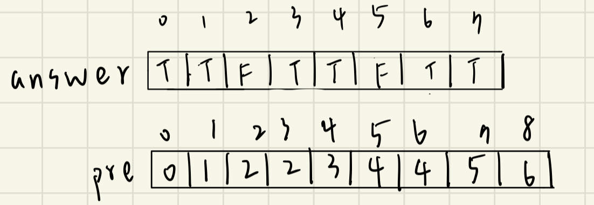

## 描述:
A teacher is writing a test with n true/false questions, with 'T' denoting true and 'F' denoting false. He wants to confuse the students by maximizing the number of consecutive questions with the same answer (multiple trues or multiple falses in a row).

You are given a string answerKey, where answerKey[i] is the original answer to the ith question. In addition, you are given an integer k, the maximum number of times you may perform the following operation:

Change the answer key for any question to 'T' or 'F' (i.e., set answerKey[i] to 'T' or 'F').
Return the maximum number of consecutive 'T's or 'F's in the answer key after performing the operation at most k times.  

Example 1:  
Input: answerKey = "TTFF", k = 2  
Output: 4  
Explanation: We can replace both the 'F's with 'T's to make answerKey = "TTTT".  
There are four consecutive 'T's.  

Example 2:  
Input: answerKey = "TFFT", k = 1  
Output: 3  
Explanation: We can replace the first 'T' with an 'F' to make answerKey = "FFFT".  
Alternatively, we can replace the second 'T' with an 'F' to make answerKey = "TFFF".  
In both cases, there are three consecutive 'F's.  

Example 3:  
Input: answerKey = "TTFTTFTT", k = 1  
Output: 5  
Explanation: We can replace the first 'F' to make answerKey = "TTTTTFTT"  
Alternatively, we can replace the second 'F' to make answerKey = "TTFTTTTT".   
In both cases, there are five consecutive 'T's.  

Constraints:   
n == answerKey.length  
1 <= n <= 5 * 104  
answerKey[i] is either 'T' or 'F'  
1 <= k <= n

## 解題思路一、 滑動窗口:  
題意: 最多修改 k 次，找到最長的相同字符子字串，使用**滑動視窗**與 **hash table** 解決。  

由於子字串越長時，越可能超出 k 的容納範圍，當子串長度增加，我們要修改的數量只會增加或不變，而不會減少，具有**單調性**，因此可以使用**不定長滑動視窗**來固定每次遍歷到的合法子字串長度，此題是典型的求最大值的**不定長滑動視窗**題目。  

### 不定長滑動窗口
先了解什麼情況下會不合法，當窗口內的字串的 'T' 及 'F' 字符數量都 > k 時，表示修改哪個都需要超過 k 次，窗口永遠無法達成相同字符的要求，有了這個條件我們使用**雙指針**來維護滑動視窗的範圍，核心思路就是在子串不合法時，固定右指针，並更新左指针的位置，使得子字串合法。  

### Hash table  
在遍歷過程中需使用 hash table 記錄兩種字母的個數，滑動窗口的題目很常使用此方法來記錄窗口內的元素個數，來確認每次移動是否合法，而每次移動指針都需要更新一次 hash table 內的計數，只需花 O(1) 即可，此題使用兩個元素的陣列記錄。

### 二進制  
要注意一點，hash table 是用一個 vector 維護兩種字母出現次數，但 vector 並不支援 char 的索引欄位，故要把 'T'、'F' 轉為數字表示。  

在二進制中，T 為 01010100，F 為 01000110，兩者在倒數第二位的位元相反，因此可以將字母的二進制先右移一位，使倒數第二位前進到最後一位，再將這 8 bits與 1(0000 0001) 做 & 位元運算，就能區分出 T 與 F 的不同了。

```C++
class Solution {
public:
    int maxConsecutiveAnswers(string answerKey, int k) {
        int n = answerKey.length();
        int max_ans = 0;
        vector<int> cnt = {0,0};   // 記錄視窗內'T'、'F'出現次數
        int l = 0;
        for(int r = 0;r < n;r++){
            cnt[answerKey[r] >> 1 & 1]++;  // 可判斷 answerKey[r] 為'T'還是'F'
            // 當窗口內 'T'、'F'個數皆 > K 時
            while(cnt[0] > k && cnt[1] > k){
                cnt[answerKey[l] >> 1 & 1]--;  // 剃除 l 位址的元素
                l++;  // l 前進
            }
            max_ans = max(max_ans,r - l + 1);
        }
        return max_ans;
    }
};
```
時間複雜度: O(n)。  
空間複雜度: O(1)，cnt 是一個長度為 2 的一維陣列。

## 解題思路二、 Prefix sum + Binary Search:
此方法也有應用一點滑動視窗的概念，視窗內存放合法的'T'、'F'兩種字母的集合字串，由於題目只是要找出最長的字串「長度」，所以我們只要計算出所有可能的視窗長度，並判斷各個長度的視窗是否有合法的'T'、'F'集合，返回最大的長度即可。  

### Pefix Sum
prefix sum 為一個累加的陣列，每格都是記錄 index 0 ~ 目前索引的累加值，此處是維護每一格以前的所有'T'個數，舉例 pre[5] = 4，代表 answerKey[5] 前有 4 個'T'，我們可以透過這個 prefix sum 快速計算區間[L,R]間的 T 出現次數 tcnt，則 F 的出現次數為 R-L+1 - tcnt，既然得出了區間(滑動視窗)內的 T、F 個數，就可以如方法一，當區間內 T、F 的個數皆 > k 時，不論如何修改都無法使字串全為同一字母。  

  

### Binary Search
由上述可知 prefix sum 是一個**有序**的陣列，每一格代表的是 'T' 的累加個數，因此可以用二分法來查找是否存在長度為 pre[mid] 的合法子字串，只要有一個長度為 pre[mid] 的子字串合法，代表該長度合法，就可以繼續往更大的 mid 前進。  

做法: 枚舉左邊界 L ∈ (0,n)，R = L + mid - 1，範圍內 tcnt <= k 或 fcnt <= k 則滿足條件


