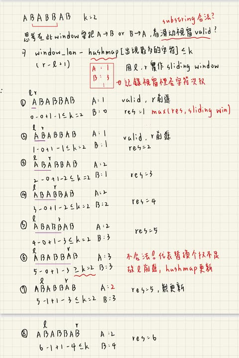

# 描述:
You are given a string s and an integer k. You can choose any character of the string and change it to any other uppercase English character. You can perform this operation at most k times.
Return the length of the longest substring containing the same letter you can get after performing the above operations.

Example 1:

Input: s = "ABAB", k = 2  
Output: 4  
Explanation: Replace the two 'A's with two 'B's or vice versa.

Example 2:

Input: s = "AABABBA", k = 1  
Output: 4  
Explanation: Replace the one 'A' in the middle with 'B' and form "AABBBBA".  
The substring "BBBB" has the longest repeating letters, which is 4.  
There may exists other ways to achieve this answer too.
 
Constraints:  
1 <= s.length <= 105  
s consists of only uppercase English letters.  
0 <= k <= s.length

## 解題思路:
這題目的想找出最長的字串長度，此字串內只能包含相同字符，且允許此字串最多能替換k個字符以符合字串內字符皆一樣，所以很容易想到要使用<font color='red'>**滑動視窗**</font>，這裡有兩個重點，一是要先知道我們使用滑動視窗去模擬此最長字串，二是滑動視窗內要如何決定該替換哪些字符以及是否合法(替換字符數量是否超過k)，因此需先建構下列元素:  
1. unordered_map:記錄**滑動視窗**內的每個字符數量  
2. l、r模擬滑動視窗範圍，其中r不斷加入字符，並檢查是否合法，若不合法則從l刪減字符    
3. 判斷公式:滑動視窗長度-hash_map內最多數量字符數量 <= k  
4. res:記錄滑動視窗長度並更新最長字符

```C++
for(){
    hash_map[r字符]++;
    判斷 滑動視窗長度-hash_map內最多數量字符數量 <= k{
        while not{
            不斷調整l;
        }
        更新res;
    }
}
```

版本一:
```C++
class Solution {
public:
    int characterReplacement(string s, int k) {
        int res = 0; // 記錄目前最長字串長度
        int l = 0;
        int max_valueCount = 0;
        unordered_map<char,int> cntValue;  // 記錄滑動視窗內出現的每個字符數量
        for(int r = 0;r < s.length();r++){
            cntValue[s[r]]++;  
            // 上一步紀錄的max_valueCount與這一步新加入的字符數量去比
            max_valueCount = max(max_valueCount,cntValue[s[r]]);
            while((r-l+1 - max_valueCount) > k){
                    cntValue[s[l]]--;
                    l++;
                }
            res = max((r-l+1),res);
        }
        return res;
    }
};
```
時間複雜度: O(n)  
空間複雜度: O(m)，unordered_map長度，m為字串內不重複字符數