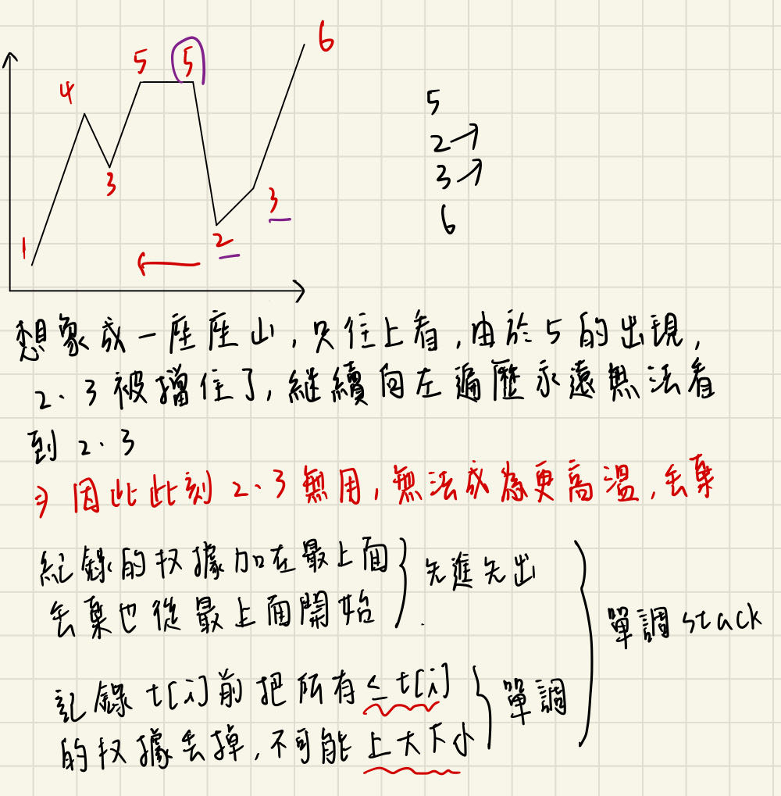
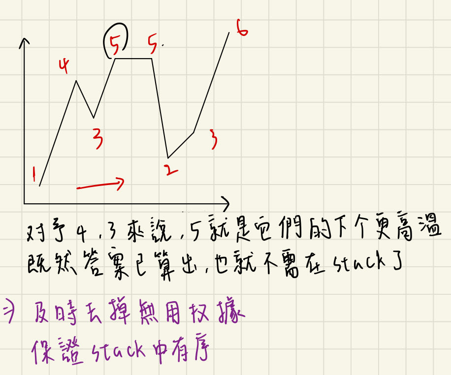
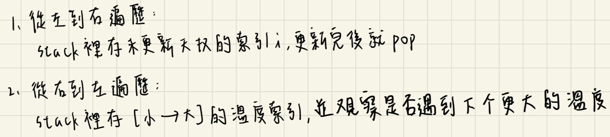

# 描述:
Given an array of integers temperatures represents the daily temperatures, return an array answer such that answer[i] is the number of days you have to wait after the ith day to get a warmer temperature. If there is no future day for which this is possible, keep answer[i] == 0 instead.


Example 1:  
Input: temperatures = [73,74,75,71,69,72,76,73]  
Output: [1,1,4,2,1,1,0,0]  

Example 2:  
Input: temperatures = [30,40,50,60]  
Output: [1,1,1,0]  

Example 3:  
Input: temperatures = [30,60,90]  
Output: [1,1,0]
 

Constraints:  
1 <= temperatures.length <= 105  
30 <= temperatures[i] <= 100

 ## 解題思路:
 此題須先理解題目，針對每個溫度天數，需要找到經過幾天後會遇到比該天更高溫的位址，因此更新的準則為找到比該天更高溫且<font color = 'red'>最近的天</font>，當第i天遇到更高溫的天數就更新answer[i]，被更新的answer[i]就不用再去管它了。  

 此題用<font color = 'red'>Satck</font>解，<font color = 'red'>**Satck裡儲存的是索引而不是溫度**</font>，這樣才能取出索引對找到更高溫的索引做計算，得出需經過幾天，有兩種版本如下:  

1. 從右到左遍歷  


 
因為向左遍歷，所以遇到更高溫時，其右邊的更低溫位址都會被擋住，也就是不可能成為後續左邊溫度的下一個高溫，因此當向左遍歷的過程中遇到比stack.top()更高溫的溫度時，就要將stack裡所有比其更低溫的元素丟棄，這些低溫天數都是無用的。  

<font color = 'red'>stack中紀錄下一个更大元素的「候選項」的索引，當遇到更大元素就要清除stack，因此stack是上小下大的有序容器。每次循環，我们可以在「候選項」中找到答案</font>

```C++
class Solution {
public:
    // 從右到左遍歷
    vector<int> dailyTemperatures(vector<int>& temperatures) {
        int n = temperatures.size();
        stack<int> st;
        vector<int> ans(n);
        for(int i = n-1;i >= 0;i--){
            int t = temperatures[i];
            // 向左遍歷遇到更高溫度，將stack裡更低溫的下標通通刪除
            while(!st.empty() && t >= temperatures[st.top()]){
                st.pop();
            }
            if(!st.empty()){
                ans[i] = st.top() - i;
            }
            st.push(i);
        }
        return ans;
    }
};
```
時間複雜度: O(n)  
空間複雜度: O(n)，運用到stack

2. **從左到右遍歷**  
 stack裡儲存的是還未更新answer的位址(天)，而不是儲存溫度!!!當迴圈前進到特定i時，也就是temperatures[i]溫度比目前stack.top()溫度更高時，該天就可以當為stack裡**所有還未被更新元素且溫度更低**的更高溫天，每一次的pop都伴隨著更新前面天數的answer，先將j = st.top()，此時的j就代表還未更新的索引值，我們就可以很容易得到先前更高溫天i會與j經過幾天。  

 可能會疑惑為何一遇到高溫的天就可以更新掉stack裡許多元素，那是因為stack裡儲存的索引是**有序的**，可以想成是日期概念，最底部是離現在最遠的日期，而stack裡都是還未遇到比其更高溫的天，一遇到t > temperatures[st.top()]的條件就代表該天是st.top()的更高溫，後續不斷更新直到遇到t <= temperatures[st.top()]。
 
```C++
class Solution {
public:
    // 從左到右遍歷
    vector<int> dailyTemperatures(vector<int>& temperatures) {
        int n = temperatures.size();
        stack<int> st;  // stack裡儲存還未更新完畢的溫度"索引"
        vector<int> ans(n);  // ans儲存答案 
        for(int i = 0;i < n;i++){
            int t = temperatures[i];
            // 當stack不為空且當前溫度大於stack的頂端溫度，代表遇到更高溫度，stack裡的天數都要更新
            // 因為while使stack內永遠保證不會有後一天比前一天溫度更高的情形
            while(!st.empty() && t > temperatures[st.top()]){
                int j = st.top(); // j為溫度位址 
                st.pop();
                ans[j] = i - j;  // 第i位址溫度更高，天數j-i
            }
            st.push(i);  // 溫度索引還未更新，加進stack裡等待
        }
        return ans;
    }
};
```
時間複雜度: O(n)  
空間複雜度: O(n)  

**總結**:

