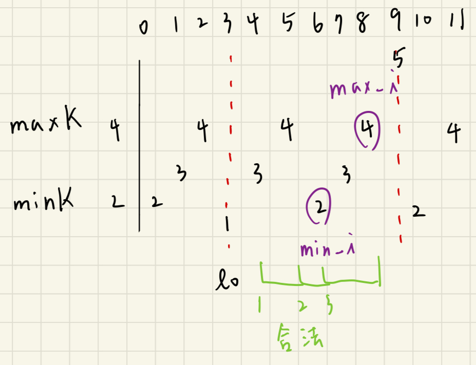

## 描述:
You are given an integer array nums and two integers minK and maxK.

A fixed-bound subarray of nums is a subarray that satisfies the following conditions:

The minimum value in the subarray is equal to minK.
The maximum value in the subarray is equal to maxK.
Return the number of fixed-bound subarrays.

A subarray is a contiguous part of an array.  

Example 1:  
Input: nums = [1,3,5,2,7,5], minK = 1, maxK = 5  
Output: 2  
Explanation: The fixed-bound subarrays are [1,3,5] and [1,3,5,2].  

Example 2:  
Input: nums = [1,1,1,1], minK = 1, maxK = 1  
Output: 10  
Explanation: Every subarray of nums is a fixed-bound subarray. There are 10 possible subarrays.  

Constraints:  
2 <= nums.length <= 105  
1 <= nums[i], minK, maxK <= 106

## 解題思路:
1. **將陣列分解成數個小陣列**    

由題可知合法子陣列中，最小值要 == minK，最大值要 == maxK，故不能包含在 [minK,maxK] 外的元素，若遇到 nums[i] < minK || nums[i] > maxK 的位址 i 時，我們可以將這個 i 視為一個屏障(切割點)，被屏障切割的左右兩區間就不能組合成一個子陣列，分別計算被屏障包圍起來的子陣列中的合法陣列數。    

2. **計算區間內子陣列數量**    

一個合法的子陣列必須同時包含 minK、maxK，我們要對陣列進行遍歷需用到三個指針 min_i、max_i、l0，其中 lo 代表在 [minK,maxK] 外的元素。  

首先枚舉右端點 i，並記錄下 minK 出現的位址 min_i，maxK 出現的位址 max_i，想找到長度最小的子陣列，就是在左右端點都剛好是 min_i、max_i (順序無差) 時，min_i、max_i 中的最小值為左端點，後續只要在左端點左邊的元素都可以當作新的左端點。  

總結: 當遍歷到 nums[i] 時，若 minK、maxK 先前都出現過，則左端點 <= min(min_i,max_i) 的子陣列都是合法的，其個數為 min(min_i,max_i) - lo，因為 lo 是屏障點。

