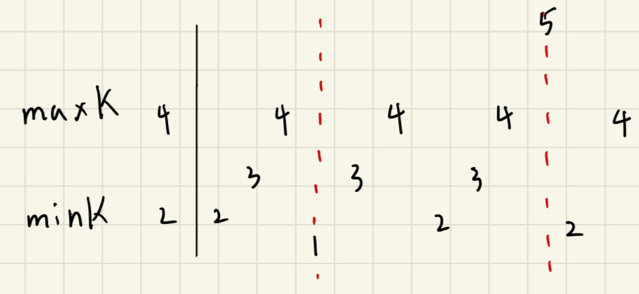

## 描述:
You are given an integer array nums and two integers minK and maxK.

A fixed-bound subarray of nums is a subarray that satisfies the following conditions:

The minimum value in the subarray is equal to minK.
The maximum value in the subarray is equal to maxK.
Return the number of fixed-bound subarrays.

A subarray is a contiguous part of an array.  

Example 1:  
Input: nums = [1,3,5,2,7,5], minK = 1, maxK = 5  
Output: 2  
Explanation: The fixed-bound subarrays are [1,3,5] and [1,3,5,2].  

Example 2:  
Input: nums = [1,1,1,1], minK = 1, maxK = 1  
Output: 10  
Explanation: Every subarray of nums is a fixed-bound subarray. There are 10 possible subarrays.  

Constraints:  
2 <= nums.length <= 105  
1 <= nums[i], minK, maxK <= 106

## 解題思路:
1. **將陣列分解成數個小陣列**    

由題可知合法子陣列中，最小值要 == minK，最大值要 == maxK，故不能包含在 [minK,maxK] 外的元素，若遇到 nums[i] < minK || nums[i] > maxK 的位址 i 時，我們可以將這個 i 視為一個屏障(切割點)，被屏障切割的左右兩區間就不能組合成一個子陣列，分別計算被屏障包圍起來的子陣列中的合法陣列數。    


2. **計算區間內子陣列數量**    

一個合法的子陣列必須同時包含 minK、maxK，我們要對陣列進行遍歷需用到三個指針 min_i、max_i、l0，其中 lo 代表在 [minK,maxK] 外的元素。  

首先枚舉右端點 i，並記錄下 minK 出現的位址 min_i，maxK 出現的位址 max_i，想找到長度最小的子陣列，就是在左右端點都剛好是 min_i、max_i (順序無差) 時，min_i、max_i 中的最小值為左端點，後續只要在左端點左邊且 > 屏障位址的元素都可以當作新的左端點。  

總結: 當遍歷到 nums[i] 時，若 minK、maxK 先前都出現過，則左端點 <= min(min_i,max_i) 的子陣列都是合法的，其個數為 min(min_i,max_i) - lo，因為 lo 是屏障點。  

**注意**:
* min_i、max_i、lo 都初始為 -1 以方便計算。
* 當 min(min_i,max_i) - lo < 0 代表 min_i、max_i 被屏障切割，兩者沒有同時出現在 lo 右側，此時以 i 為右端點的合法子陣列各數為 0。


```C++
class Solution {
public:
    int long long countSubarrays(vector<int>& nums, int minK, int maxK) {
        long long ans = 0;
        int n = nums.size();
        int min_i = -1, max_i = -1, lo = -1;
        // 枚舉右端點 i
        for(int i = 0;i < n;i++){
            int x = nums[i];
            // 紀錄 minK、maxK 出現位址
            if(x == minK){
                min_i = i;
            }
            if(x == maxK){
                max_i = i;
            }
            // x 不在 [minK,maxK] 內，更新屏障位址
            if(x < minK || x > maxK){
                lo = i;  
            }
            // 與 0 比大小判斷是否 min_i,max_i 都出現在同一個區間內
            ans += max(min(min_i,max_i) - lo , 0 );
        }
        return ans;
    }
};
```
時間複雜度: O(n)  
空間複雜度: O(1)