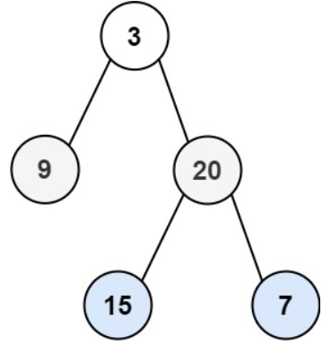

# 描述:
Given the root of a binary tree, return the level order traversal of its nodes' values. (i.e., from left to right, level by level).

Example 1:
  
Input: root = [3,9,20,null,null,15,7]  
Output: [[3],[9,20],[15,7]]

Example 2:
Input: root = [1]  
Output: [[1]]  

Example 3:  
Input: root = []  
Output: []
 
Constraints:
The number of nodes in the tree is in the range [0, 2000].
-1000 <= Node.val <= 1000

## 解題思路:
inary tree的level order traversal是用queue來實現，因為queue有<font color = 'red'>先進先出</font>的功能，因此可以一層一層使節點由上而下，由左往右加入佇列裡再取出，但要注意此題不僅要實現level order，還要將結果一層一層存到一個vector<vector<int>>中，因此要思考每一層該如何單獨取出並儲存。  

此題可以用  
```
while(!q.empty()){
    for(int i = 0;i < q.size();i++){
        ...
    }
}
```
來實現每一層的儲存，因為當跑完一個完整的for迴圈，就等於將下一層的所有子點新增進queue中
```C++
class Solution {
public:
    vector<vector<int>> levelOrder(TreeNode* root) {
        vector<vector<int>> res;
        queue<TreeNode*> q;  // queue來實現BFS搜尋
        q.push(root);
        while(!q.empty()){   // 持續搜尋至queue為空
            int size = q.size(); // 儲存每一層大小
            vector<int> level;  // 儲存每一層節點
            for(int i = 0;i < size;i++){
                TreeNode* node = q.front();  // 取出queue最前端
                q.pop();  // 拜訪該節點
                if(node){
                    level.push_back(node->val);
                    if(node->left != nullptr)   q.push(node->left);
                    if(node->right != nullptr)  q.push(node->right);
                }
            }
            if(!level.empty()){
                res.push_back(level);
            }
        }
        return res;
    }
};
```
時間複雜度: O(n)  
空間複雜度: O(n),使用到queue與vector<int> level兩個容器，各用O(n)空間