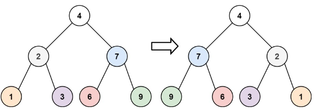

# 描述:
Given the root of a binary tree, invert the tree, and return its root.
Example 1:

Input: root = [4,2,7,1,3,6,9]
Output: [4,7,2,9,6,3,1]

Example 2:
Input: root = [2,1,3]
Output: [2,3,1]

Example 3:
Input: root = []
Output: []

版本一:
```C++
class Solution {
public:
    // 遞迴反轉二元樹
    TreeNode* invertTree(TreeNode* root) {
        if (root) {
            invertTree(root->left);
            invertTree(root->right);

            TreeNode* temp = root->left;
            root->left = root->right;
            root->right = temp;
        }
        return root;
    }
};
```
時間複雜度: O(n)，n為二元樹節點個數  
空間複雜度: O(n)，用遞迴Stack的空間

 