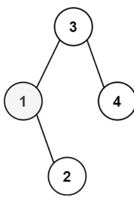
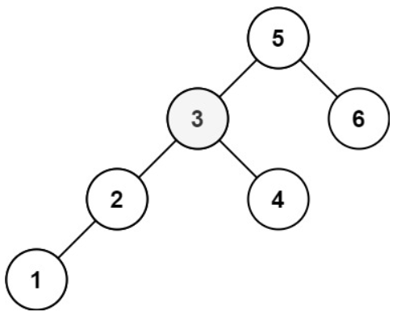

# 描述:
Given the root of a binary search tree, and an integer k, return the kth smallest value (1-indexed) of all the values of the nodes in the tree.

Example 1:  

Input: root = [3,1,4,null,2], k = 1  
Output: 1  

Example 2:    

Input: root = [5,3,6,2,4,null,null,1], k = 3  
Output: 3
 
Constraints:  
The number of nodes in the tree is n.  
1 <= k <= n <= 104  
0 <= Node.val <= 104

## 解題思路:
此題要找二元搜尋樹中第k小的節點，有兩種方法可解:  
1. Inoder traversal:  
二元樹的中序搜尋是左中右，若是BST則是<font color = 'red'>由小到大</font>遍歷節點，因此對BST做Inorder遍歷到第k個節點即是答案。  

版本一: Inorder
```C++
class Solution {
public:
    int kthSmallest(TreeNode* root, int& k) { // 注意k改成引用，透過k的位址直接修改k
        if(root == nullptr){
            return -1;  // 代表第k小未找到
        }
        // 先在左子樹找答案
        int left_res = kthSmallest(root->left,k); 
        if(left_res != -1){  // 不等於-1代表答案存在於左子樹
            return left_res; 
        }
        k--;
        // k為0代表root節點即為第k小
        if(k == 0){
            return root->val;
        }
        return kthSmallest(root->right,k); // 若上述都未找到代表答案存在右子樹 
    }
};
```
時間複雜度: O(n)  
空間複雜度: O(h)，h為樹高，因為有使用到遞迴Stack  
* Worst case: skewed tree，則h = n  


2. DFS Iteractive:  
使用DFS一樣做Inorder追蹤，且使用Stack方法，步驟為:  
* let stack、cur = root
* 不斷加左子點進stack中，並cur = cur->left，當cur指向的左子點已經到nullptr，pop stack
* pop該節點的概念為拜訪，故k--，看k現在是否已經拜訪到第k個節點，若是代表其為第k小節點
* cur = cur->right，如Inorder一樣最後拜訪右子樹

版本二: DFS Iterative(Stack)
```C++
class Solution {
public:
    int kthSmallest(TreeNode* root, int& k) { // 注意k改成引用，透過k的位址直接修改k
        TreeNode* cur = root;
        stack<TreeNode*> stack;  // 使用stack實現Inorder
        while(!stack.empty() || cur != nullptr){
            // 當cur不為空，則不斷加進左子點
            while(cur != nullptr){
                stack.push(cur);
                cur = cur->left;
            }
            // cur以為空，代表上個節點的左子點為空
            cur = stack.top();  // pop出該點
            stack.pop();
            k--;
            // 代表已拜訪到第k小的節點
            if(k == 0){
                return cur->val;
            }
            cur = cur->right;  // Inorder最後一步拜訪右子樹
        }
        return -1;
    }
};
```
時間複雜度: O(n)  
空間複雜度: O(h)，h為樹高，因為有使用到遞迴Stack    
* Worst case: skewed tree，則h = n  