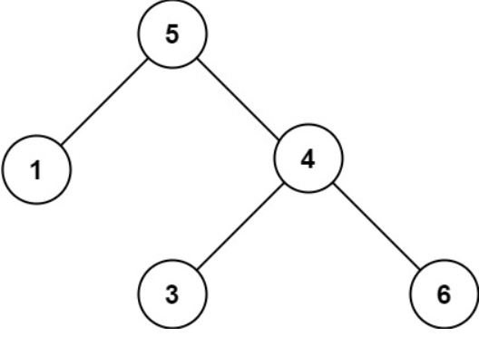
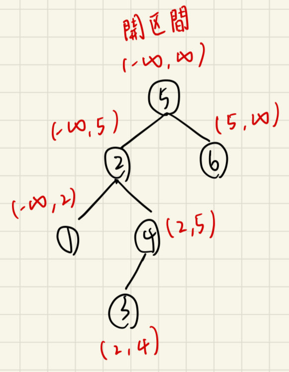

# 描述:
Given the root of a binary tree, determine if it is a valid binary search tree (BST).

A valid BST is defined as follows:

* The left subtree of a node contains only nodes with keys less than the node's key.  
* The right subtree of a node contains only nodes with keys greater than the node's key.  
* Both the left and right subtrees must also be binary search trees.
 
Example 1:  
Input: root = [2,1,3]  
Output: true  

Example 2:    

    

Input: root = [5,1,4,null,null,3,6]  
Output: false  
Explanation: The root node's value is 5 but its right child's value is 4.
 

Constraints:

The number of nodes in the tree is in the range [1, 104].  
-231 <= Node.val <= 231 - 1

## 解題思路:    
    

1. 首先使用前序(中左右)方法遍歷每個節點，先判斷每個節點是否符合界限開區間範圍內，若符合再遞迴判斷其左右子點，要注意更新左右界限規則  
* 更新左子點: 左界限為原先的左界限，而右界限則更新為目前節的值。  
* 更新右子點: 右界限為原先的右界限，而左界限則更新為目前節的值。  
最大最小值可用long long val = LLONG_MIN(MAX)來表示，雖然题目是int類型，但因為BST要求是開區間，故開始遞迴時，<font color = 'red'>left需要比所有節點值都要小，right需要比所有節點值都要大</font>，如果節點值剛好是int的最小值/最大值，就没有這樣的left和right了，所以需要用long型別。  

    

版本一:
```C++
class Solution {
public:
    // 用前序(中左右)遍歷方法檢查，先判斷再遞迴 
    bool isValidBST(TreeNode* root,long long left = LLONG_MIN,long long right = LLONG_MAX) {  // 新增左右界限參數
        if(root == nullptr){
            return true;
        }
        int x = root->val;
        // 判斷目前節點是否在左右開區間內
        if(left < root->val && root->val < right){
            // 若是則判斷其左子點與右子點是否也符合BST定義，並要更新界限
            return isValidBST(root->left,left,x) && isValidBST(root->right,x,right);
        }
        return false;
    }
};
```
時間複雜度: O(n)，需遍歷每個節點才能判斷是否valid
空間複雜度: O(n)，使用到遞迴stack  


版本二: 中序遍歷(左中右)，先判斷左子樹，再比較目前節點，最後判斷右子樹
```C++
class Solution {
public:
    long long pre = LLONG_MIN;  // pre要設為全域變數才能在每個遞迴間同步
    // 用中序(左中右)，判斷目前節點是否大於上個節點pre
    bool isValidBST(TreeNode* root) {  
        if(root == nullptr){
            return true;
        }
        // step1: 判斷左子樹是否符合BST
        if(!isValidBST(root->left)){
            return false;
        }
        // step2: 判斷目前節點是否>上個子點
        if(root->val <= pre){
            return false;
        }
        pre = root->val;  // 將pre更新為目前節點以便下個遞迴比較
        // 返回右子樹是否也為BST
        return isValidBST(root->right);
    }
};
```
時間複雜度: O(n)，須遍歷BST中每個節點  
空間複雜度: O(n)，BST最壞情況下會退化成一條鏈(題目沒有保證平衡)，故遞迴Stack需要n個空間
