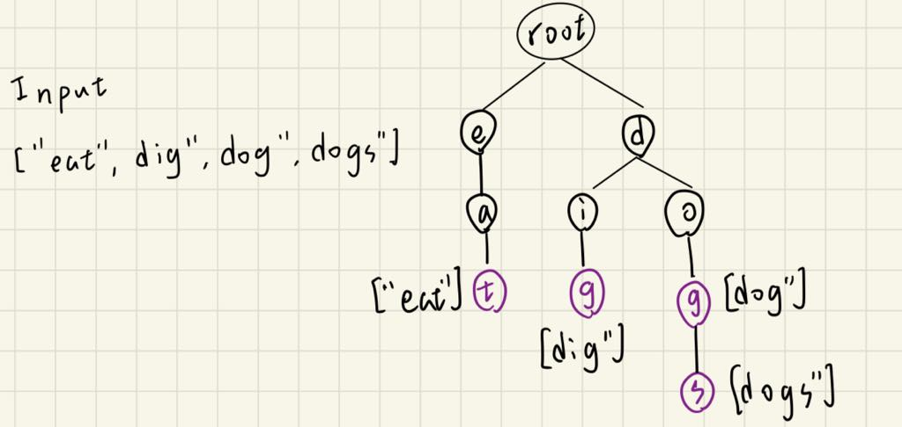

# 描述:
A trie (pronounced as "try") or prefix tree is a tree data structure used to efficiently store and retrieve keys in a dataset of strings. There are various applications of this data structure, such as autocomplete and spellchecker.

Implement the Trie class:

Trie() Initializes the trie object.
void insert(String word) Inserts the string word into the trie.
boolean search(String word) Returns true if the string word is in the trie (i.e., was inserted before), and false otherwise.
boolean startsWith(String prefix) Returns true if there is a previously inserted string word that has the prefix prefix, and false otherwise.
 

Example 1:    
Input  
["Trie", "insert", "search", "search", "startsWith", "insert", "search"]  
[[], ["apple"], ["apple"], ["app"], ["app"], ["app"], ["app"]]  
Output  
[null, null, true, false, true, null, true]  

Explanation  
Trie trie = new Trie();  
trie.insert("apple");  
trie.search("apple");   // return True   
trie.search("app");     // return False  
trie.startsWith("app"); // return True  
trie.insert("app");  
trie.search("app");     // return True

## 解題思路:
是一種樹狀結構，又稱為字典樹，root node 為空字串，每個節點都儲存一個字元(char)，某一個 node 的 chidren node 都會有相同的字首(該node本身)，因為前綴相同，又稱為「前綴樹」，Trie 的每條 path 都代表一個完整字串或非完整字串。


```C++
class Trie{
private:
    // 建構TrieNode(Trie結構的節點)
    struct TrieNode{
        TrieNode* child[26]; // node的下個節點為何
        bool isEndOfWord;    // 判斷node是否為字串結尾
        // 建構TrieNode
        TrieNode():isEndOfWord(false){
            for(int i = 0;i < 26;i++){
                child[i] = nullptr;
            }
        }
    };
    
    TrieNode* root;
public:
    // 建構Trie結構
    Trie(){
        root = new TrieNode();  // 設root為新的TrieNode
    }
    // insert
    void insert(string word){
        TrieNode* cur = root;
        for(char ch:word){
            int index = ch - 'a'; // index是ch的ASCII碼
            // 該字符不存在於Trie中，為其創造新節點
            if(cur->child[index] == nullptr){  
                cur->child[index] = new TrieNode();  
            }
            cur = cur->child[index];  // 前進到Trie中的下個字符
        }
        cur->isEndOfWord = true;  // 遍歷完畢，最後一個節點為結尾
    }
    
    // search
    bool search(string word){
        // 有可能某路徑上存在此字串，但其實字串並不在Trie中
        return find(word) && find(word)->isEndOfWord;
    }
    // startWith
    bool startsWith(string prefix){
        // 只需判斷存在即可，不需看其是否為結尾
        return find(prefix);
    }
private:
    // find輔助函式，判斷str是否存在
    TrieNode* find(string str){
        TrieNode* cur = root;
        for(char ch:str){
            int index = ch - 'a'; 
            if(cur->child[index] == nullptr){
                return nullptr; // 代表此字串不存在
            }
            cur = cur->child[index];
        }
        // cur會包含isEndOfWord資訊，可判斷其是否為結尾
        return cur;
    }
};
```

時間複雜度: 初始化為O(1)，insert為O(n∣Σ∣)，其餘為O(n)，n為word長度，∣Σ∣ = 26是字符集合的大小
注意插入一個字符(創建一個節點)的時間為O(∣Σ∣)，因為有在路徑上遍歷，最多會遍歷26次才找到自己的位置  

空間複雜度: O(t)，t為Trie內的節點數