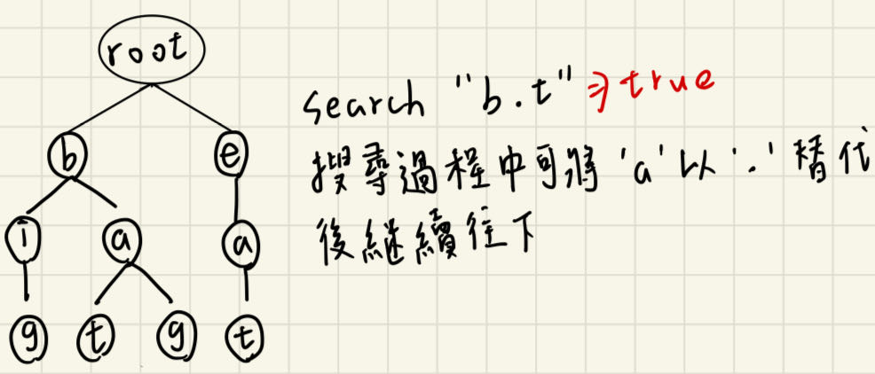

# 描述:
Design a data structure that supports adding new words and finding if a string matches any previously added string.

Implement the WordDictionary class:

WordDictionary() Initializes the object.
void addWord(word) Adds word to the data structure, it can be matched later.
bool search(word) Returns true if there is any string in the data structure that matches word or false otherwise. word may contain dots '.' where dots can be matched with any letter.
 

Example:  
Input  
["WordDictionary","addWord","addWord","addWord","search","search","search","search"]  
[[],["bad"],["dad"],["mad"],["pad"],["bad"],[".ad"],["b.."]]  

Output  
[null,null,null,null,false,true,true,true]

Explanation  
WordDictionary wordDictionary = new WordDictionary();  
wordDictionary.addWord("bad");  
wordDictionary.addWord("dad");   
wordDictionary.addWord("mad");  
wordDictionary.search("pad"); // return False  
wordDictionary.search("bad"); // return True  
wordDictionary.search(".ad"); // return True  
wordDictionary.search("b.."); // return True  

## 解題思路:
此題的資料結構與Trie結構相同，insert與search基本一樣，只是題目在search有個變形，欲查詢字串可能包含'.'字符，而「.」可以替代為任何字母，作為其中一個TrieNode(前提是替換的字符要存在於Trie路徑上)，如下圖，則serach("bat")結果為true 
  

解這題前我們回想一下dfs追蹤，針對目前頂點v，我們要在對v的所有相鄰頂點都做一次dfs拜訪，直到都無法在走到一個尚未拜訪過的頂點。  
首先從root做dfs，當我們遇到'.'的node時，就針對其可能child node再做dfs，如此遞迴下去並判斷字串是否存在於Trie，注意做dfs前我們要遍歷TrieNode的所有child(26個)，若其不是nullptr代表存在於路徑上，則對其遞迴做dfs判斷子字串是否存在，且子自傳從'.'的下一個位址開始。

```C++
class WordDictionary {
private:
    // 建構TrieNode(Trie結構的節點)
    struct TrieNode{
        TrieNode* child[26]; // node的下個節點為何
        bool isEndOfWord;    // 判斷node是否為字串結尾
        // 建構TrieNode
        TrieNode():isEndOfWord(false){
            for(int i = 0;i < 26;i++){
                child[i] = nullptr;
            }
        }
    };
    TrieNode* root;
    
    // 若遇到'.'，則使用dfs函式遍歷所有字母，且從第j個開始到結尾
    bool dfs(string word,TrieNode* root,int j){
        TrieNode* cur = root;
        for(int i = j;i < word.length();i++){
            char ch = word[i];
            // 若字符不為'.'，則前進至下個node，如同Trie的search一樣
            if(ch != '.'){
                int index = ch - 'a';
                if(cur->child[index] == nullptr){  // 代表此字符不存在於路徑上
                    return false;
                }
                cur = cur->child[index];
            }
            // ch為'.'，將其當為所有字母節點遍歷一次
            else{  
                // 遍歷cur的所有child子節點(26個字母)
                for(TrieNode* node:cur->child){
                    // 遞迴呼叫dfs，且字串從i+1開始
                    if(node != nullptr && dfs(word,node,i+1)){
                        return true;
                    }
                }
                return false;
            }
        }
        // 字串都遍歷完畢，也有可能其不Trie裡的關鍵字，還要看最後一個node的isEndOfWord是否為true
        return cur->isEndOfWord;
    }
public:
    WordDictionary() {
        root = new TrieNode();
    }
    
    void addWord(string word) {
        TrieNode* cur = root;
        for(char ch:word){
            int index = ch - 'a';
            if(cur->child[index] == nullptr){
                cur->child[index] = new TrieNode();
            }
            cur = cur->child[index];
        }
        cur->isEndOfWord = true;
    }
    
    bool search(string word) {
        return dfs(word,root,0);
    }
};
```
時間複雜度: 初始化為O(1)，addWord為O(n∣Σ∣)，search為O(26的n次方)，n為word長度，∣Σ∣ = 26是字符集合的大小  
注意插入一個字符(創建一個節點)的時間為O(∣Σ∣)，因為有在路徑上遍歷，最多會遍歷26次才找到自己的位置  
而search最壞情況是字串都是'.'，代表每次遍歷都需嘗試26種情況。    

空間複雜度: O(t)，t為Trie內的節點數