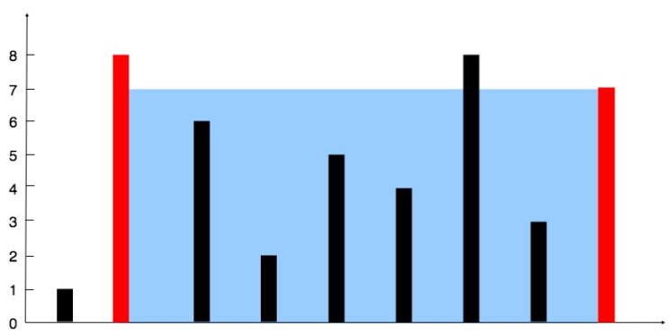

# 描述:
You are given an integer array height of length n. There are n vertical lines drawn such that the two endpoints of the ith line are (i, 0) and (i, height[i]).
Find two lines that together with the x-axis form a container, such that the container contains the most water.
Return the maximum amount of water a container can store.
Notice that you may not slant the container.

Example 1:
  
Input: height = [1,8,6,2,5,4,8,3,7]
Output: 49  
Explanation: The above vertical lines are represented by array [1,8,6,2,5,4,8,3,7]. In this case, the max area of water (blue section) the container can contain is 49.

Example 2:  
Input: height = [1,1]  
Output: 1
 
Constraints:  
n == height.length  
2 <= n <= 105  
0 <= height[i] <= 104

## 解題思路:
此題需使用一頭一尾雙指針來記錄兩側的索引目前遍歷到哪，有個重要概念是水量面積計算為 (j - i) * min(height[i],height[j])，雙指針的移動規則為較小高度height[?]的指針移動，因為移動寬度一定會減小1，所以如果再移動較大的那方，一定不會增加面積。

版本一:
```C++
class Solution {
public:
    int maxArea(vector<int>& height) {
        // 使用雙指針從頭尾遍歷
       int i = 0;
       int j = height.size()-1;
       int currentArea = (j - i) * min(height[i],height[j]); // currentArea儲存目前水量面積
       int maxArea = currentArea; 
       while(i < j){
            // 比較i,j指標對應的高度，較小高度的指針移動
            if(height[i] <= height[j]){
                i++;
            }
            else{
                j--;
            }
            // 計算目前面積，並不斷與maxArea比較
            currentArea = (j - i) * min(height[i],height[j]);
            maxArea = max(maxArea,currentArea);
       }
       return maxArea;
    }
};
```
時間複雜度: O(n)，n為height陣列長度  
空間複雜度: O(1)


